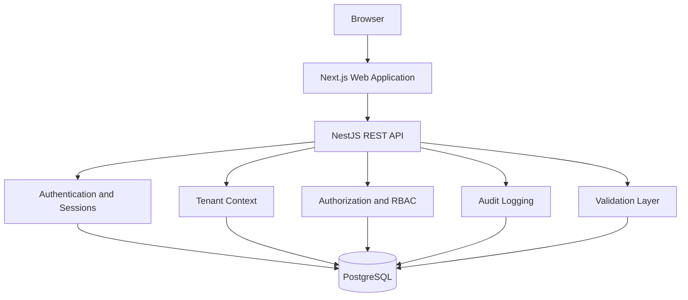

# Multi-Tenant SaaS Starter

Production-oriented multi-tenant SaaS reference implementation built with Next.js, NestJS, PostgreSQL and Prisma.

This repository is an independent reference implementation created for technical demonstration. It does not contain proprietary source code from commercial products.

## Status

The project is local-first and ready for technical review: authentication, tenant creation, memberships, RBAC, invitations, projects, audit logs, migrations, seed data, Docker Compose, unit tests, integration tests and CI are implemented.

Known limitation: a real browser E2E suite is not configured yet. `pnpm test:e2e` currently runs the API-level end-to-end suite through the same HTTP integration coverage used by `pnpm test:integration`.

## Live demo

This project is designed as a local-first technical reference implementation. A public deployment is not required to explore the architecture, tests and application behavior.

## Screenshots

Screenshots are intentionally not faked. Capture them locally after running the app and place them under `docs/images/`.

Required files:

- `docs/images/dashboard.png`
- `docs/images/projects.png`
- `docs/images/members.png`
- `docs/images/audit-log.png`
- `docs/images/workspace-switcher.png`

See [docs/SCREENSHOTS.md](docs/SCREENSHOTS.md).

## Short Demo Walkthrough

1. Start the stack locally.
2. Log in as `owner@example.com`.
3. Open the seeded `acme` workspace.
4. Create a project.
5. Review the audit log.
6. Switch to `beta` and confirm `acme` data is not visible.
7. Log in as `viewer@example.com` and confirm mutation actions are blocked.

See [docs/DEMO.md](docs/DEMO.md).

## Architecture



## Core Features

- Email/password auth with bcrypt hashes.
- HttpOnly session cookies with hashed database tokens.
- CSRF token check for authenticated mutations.
- Tenant context resolved from authenticated membership.
- OWNER, ADMIN, MEMBER and VIEWER roles.
- Invitation workflow with hashed opaque tokens.
- Project CRUD scoped by tenant.
- Audit records for important workspace changes.
- Health and readiness endpoints.
- Swagger available locally at `/docs`.

## Technology Stack

- Next.js 16 and React 19
- NestJS 11 REST API
- PostgreSQL 16 and Prisma 6
- Zod contracts
- pnpm workspaces and Turborepo
- Vitest, ESLint, Prettier
- Docker Compose
- GitHub Actions

## Domain Model

- `User`: account identity and password hash.
- `Session`: hashed session token and expiry.
- `Tenant`: workspace boundary.
- `Membership`: user, tenant and role.
- `Invitation`: tenant invite with hashed token.
- `Project`: tenant-owned work item.
- `AuditLog`: tenant-scoped activity trail.

## Tenant Isolation

Tenant context comes from the authenticated user's membership and the workspace slug. Client-provided tenant ownership is ignored. Tenant-owned reads and writes include tenant scope, assignees must belong to the same tenant, and cross-tenant tests protect against regressions.

PostgreSQL RLS is not implemented. It is a good future defense layer, but this repository currently demonstrates application-level tenant scoping.

## Authorization Model

| Action              | OWNER | ADMIN   | MEMBER | VIEWER |
| ------------------- | ----- | ------- | ------ | ------ |
| View projects       | Yes   | Yes     | Yes    | Yes    |
| Create project      | Yes   | Yes     | Yes    | No     |
| Update project      | Yes   | Yes     | Yes    | No     |
| Archive project     | Yes   | Yes     | No     | No     |
| Manage invitations  | Yes   | Limited | No     | No     |
| Manage member roles | Yes   | No      | No     | No     |
| View members        | Yes   | Yes     | No     | No     |
| View audit logs     | Yes   | Yes     | No     | No     |
| Workspace settings  | Yes   | No      | No     | No     |

OWNER invitations cannot create another OWNER. ADMIN invitations are limited to MEMBER and VIEWER.

## Invitation Workflow

1. OWNER or ADMIN creates an invitation.
2. The API returns a local development URL once.
3. Only the token hash is stored.
4. The accepting user must match the invited email.
5. Expired, revoked or already-used-by-another-account invitations fail.
6. Repeated acceptance by the same account is idempotent.
7. Acceptance creates one membership and one audit event.

## API Overview

- `POST /auth/register`
- `POST /auth/login`
- `POST /auth/logout`
- `GET /auth/me`
- `POST /tenants`
- `GET /tenants`
- `GET /tenants/:slug`
- `PATCH /tenants/:slug`
- `GET /tenants/:slug/members`
- `PATCH /tenants/:slug/members/:membershipId`
- `DELETE /tenants/:slug/members/:membershipId`
- `POST /tenants/:slug/invitations`
- `GET /tenants/:slug/invitations`
- `DELETE /tenants/:slug/invitations/:invitationId`
- `POST /invitations/:token/accept`
- `POST /tenants/:slug/projects`
- `GET /tenants/:slug/projects`
- `GET /tenants/:slug/projects/:projectId`
- `PATCH /tenants/:slug/projects/:projectId`
- `DELETE /tenants/:slug/projects/:projectId`
- `GET /tenants/:slug/audit-logs`
- `GET /health`
- `GET /health/ready`

## Local Setup

```bash
pnpm install
cp .env.example .env
docker compose up -d postgres
pnpm db:generate
pnpm db:migrate
pnpm db:seed
pnpm dev
```

Open:

- Web: `http://localhost:3000`
- API: `http://localhost:4000`
- Swagger: `http://localhost:4000/docs`

Stop containers:

```bash
docker compose down
```

Reset the development database:

```bash
pnpm db:reset
```

`db:reset` drops local development data, reapplies migrations and runs the Prisma seed.

## Seed Accounts

Use `SEED_PASSWORD` from `.env`.

- `owner@example.com`
- `admin@example.com`
- `member@example.com`
- `viewer@example.com`

## Environment Variables

Copy `.env.example` to `.env`. Values are local placeholders only.

- `DATABASE_URL`
- `TEST_DATABASE_URL`
- `SESSION_SECRET`
- `API_PORT`
- `WEB_PORT`
- `WEB_ORIGIN`
- `NEXT_PUBLIC_API_URL`
- `SEED_PASSWORD`
- `SECURITY_CONTACT`

## Database Migrations

```bash
pnpm db:generate
pnpm db:migrate
pnpm db:seed
pnpm db:reset
```

Integration tests use `TEST_DATABASE_URL`. Run migrations against the test database before `pnpm test:integration` when working outside CI.

## Docker

`docker-compose.yml` includes:

- `postgres` on host port `15432`
- `postgres-test` on host port `15433`
- optional `api` and `web` build targets

For local development, starting `postgres` is enough. For integration tests, start `postgres-test` too.

## Testing

```bash
pnpm test
pnpm test:integration
```

The integration suite starts a real NestJS app, uses PostgreSQL through Prisma and validates authentication, tenant isolation, role enforcement, final OWNER protection, invitation safety and audit behavior.

## Quality Commands

```bash
pnpm format:check
pnpm lint
pnpm typecheck
pnpm test
pnpm test:integration
pnpm build
```

## Security Decisions

- Session tokens are opaque and stored as SHA-256 hashes.
- Session cookie is HttpOnly.
- CSRF cookie is readable and must match `x-csrf-token` for mutations.
- Invitation tokens are opaque, hashed at rest and redacted from logs.
- Passwords are hashed with bcrypt.
- Tenant-owned writes include tenant scope.
- Cross-tenant misses return safe `404` responses where resource discovery would be risky.

See [SECURITY.md](SECURITY.md), [docs/security.md](docs/security.md), [docs/tenancy.md](docs/tenancy.md) and [docs/authorization.md](docs/authorization.md).

## Trade-offs

- Application-level tenant scoping keeps the implementation readable; RLS is a future hardening option.
- Session auth is used because this is a browser-first SaaS reference.
- A single PostgreSQL database is enough for the demonstration.
- No billing, external email provider, object storage or public deployment is included.
- Invitation delivery is local-first: the API returns a development URL instead of sending email.
- The scope favors correctness and reviewability over product breadth.

## Known Limitations

- No production email delivery.
- No billing/subscription module.
- No PostgreSQL RLS layer.
- No real browser E2E suite yet.
- The web console is functional but intentionally compact.

## Project Structure

```txt
apps/api              NestJS API
apps/web              Next.js web console
packages/database     Prisma schema, migrations and seed
packages/contracts    Shared Zod schemas
packages/config       Environment validation
packages/ui           Small shared UI primitives
docs/                 Architecture and review docs
```

## Roadmap

- Add Playwright browser E2E coverage.
- Add PostgreSQL RLS as a defense-in-depth example.
- Add email-provider adapter behind the invitation workflow.
- Add more granular web routes for projects, members, audit and settings.

## Contributing

Keep changes focused. Any tenant-owned read or write must carry trusted tenant context, and tests should prove cross-tenant behavior when the blast radius is meaningful.

## License

MIT
